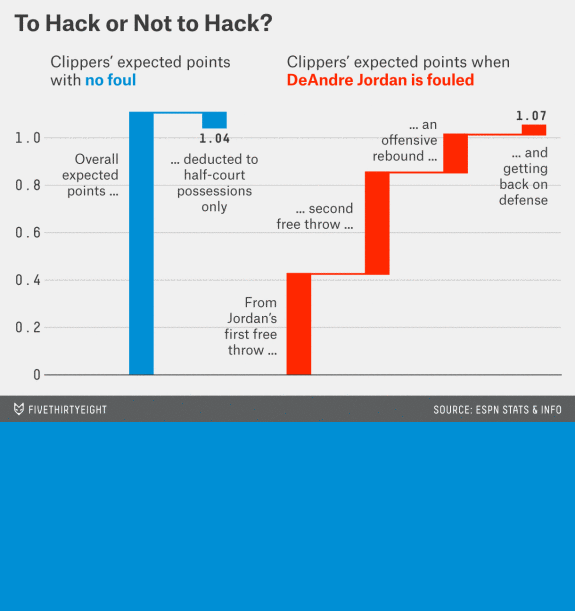

class: middle, center

```{r setup, echo = FALSE, message = FALSE, warning = FALSE}
library(tidyverse)
library(Cairo)
library(flipbookr)
library(xaringan)
library(xaringanExtra)

xaringanExtra::use_search(show_icon = TRUE)

knitr::opts_chunk$set(message = FALSE, warning = FALSE, comment = " ", cache = FALSE, dev = "CairoSVG")

set.seed(1234)
```


```{r, echo=FALSE, out.width="650px",out.height="400px", fig.cap="<a href='https://xkcd.com/1945/'>https://xkcd.com/1945</a>"}
knitr::include_graphics("https://imgs.xkcd.com/comics/scientific_paper_graph_quality.png")
```

---

# Motivation

--

**Why bother improving the quality of your plot?**

--

- <p>Helps people <strong>remember</strong> your results better</p>

--

- Makes your findings look more **credible**

--

- Increases the chance of your work being **shared**

--

- Shows **respect** for your audience

<br>

--

**Goal of this presentation**

--

- <p>Share practical, language-agnostic tips for improving readability & accessibility</p>

--

- Walk through implementations of these ideas (w/ [R code](https://raw.githubusercontent.com/yjunechoe/sandbox/master/flipbooks/ggplot2_master/feb_2020_ggplot2.Rmd))

--

- Demonstrate that the _design_ just as important as the content

---

# Outline

--

**Four principles for explanatory data visualization**

--

- <p>Make your <strong>text</strong> readable</p>

--

- Be generous about **margins and spacing**

--

- Make the **legend** clear but subtle

--

- Make **color** easy on your reader's eyes

--

<br>

**Showcases/tricks**

- Minimal designs

- Plot composition

- Animations

- Interactivity


---

# Preliminaries

.pull-left[

The `{ggplot2}` ecosystem in R:

- Easy to use and highly customizable

- Tons of free resources for learning

- Widely used in academia

- Lots of extensions

]

.pull-right[

```{r, echo=FALSE, out.width="400px", fig.align="right"}
knitr::include_graphics("https://d33wubrfki0l68.cloudfront.net/2c6239d311be6d037c251c71c3902792f8c4ddd2/12f67/css/images/hex/ggplot2.png")
```

]


---


# Preliminaries

.pull-left[

The `{ggplot2}` ecosystem in R:

- Easy to use and highly customizable

- Tons of free resources for learning

- Widely used in academia

- Lots of extensions

```{r, message = FALSE}
library(extrafont)
library(colorspace)
library(patchwork)
library(ggtext)
library(scales)
# library(gghighlight)
# library(ggforce)
# library(ggrepel)
# library(gganimate)
```

]

.pull-right[
<iframe src="https://exts.ggplot2.tidyverse.org/gallery/" loading=lazy height="450px" width="510px" style="position:absolute; height:580px; top:50px">
]


---

# The layered Grammar of Graphics

<blockquote style="margin-bottom:40px"><strong><em>A framework is less rules, not more</em></strong></blockquote>

```{r, echo=FALSE, out.width="420px", fig.align="center", fig.cap="<a href='https://www.youtube.com/watch?v=h29g21z0a68'>Video Tutorial</a>"}

```

---

```{r, echo = FALSE, message = FALSE, warning = FALSE}
state_election_votes <- read_csv("https://vincentarelbundock.github.io/Rdatasets/csv/pscl/presidentialElections.csv") %>% 
  select(State = state, demVote, Year = year) %>% 
  mutate(demVote = round(demVote/100, 2))
```


```{r example-1, include = FALSE, dpi = 100}
# Presidential election results from 1932-2016
state_election_votes %>% 
  filter(State %in%
    c("Pennsylvania",
    "Illinois",
    "California")
  ) %>% 
  ggplot() +
  aes(
    x = Year,
    y = demVote,
    color = State
  ) +
  geom_point() + #OMIT
  geom_point() + #ROTATE
  geom_line() + #ROTATE
  geom_line(size = 1) + #ROTATE
  scale_y_continuous(
    labels = percent_format(accuracy = 1)
  ) +
  scale_x_continuous(
    breaks = pretty_breaks(n= 5) 
  ) +
  labs(
    y = "Democrat Votes",
    title = "Go Vote!"
  )
  
```

`r chunk_reveal("example-1", omit = "#ROTATE", "auto", widths = c(40, 60))`

---

`r chunk_reveal("example-1", omit = "#OMIT", break_type = "rotate", widths = c(40, 60))`

---

# Yay a plot!

```{r, echo = FALSE}
state_election_plot <- state_election_votes %>% 
  filter(State %in%
    c("Pennsylvania",
    "Illinois",
    "California")
  ) %>% 
  ggplot() +
  aes(
    x = Year,
    y = demVote,
    color = State
  ) +
  geom_line(size = 1) +
  scale_y_continuous(
    labels = percent_format(accuracy = 1)
  ) +
  scale_x_continuous(
    breaks = pretty_breaks(n= 5) 
  ) +
  labs(
    y = "Percent of Democrat Votes",
    title = "Go Vote!"
  )
```

.pull-left[

```{r state_election_plot, echo = FALSE, fig.align="center", out.height="450px", dpi = 100}
state_election_plot
```

]

.pull-right[

]

---


# Yay a plot... ?

.pull-left[

```{r state_election_plot, echo = FALSE, fig.align="center", out.height="450px", dpi = 100}
```

]

.pull-right[

**Areas of improvement**

- Text is small and narrow

- Plot elements are squished together

- Difficult to focus on individual colors

- Legend is off to the side on its own

]

---

class: inverse, center, middle

# 1. Text

---

#1. Text

Many different ways to style text:

--

- <p><span style="font-size: .7em">font</span> <span style="font-size: 1.5em">size</span></p>

--

- Font face (<strong style="color:black">bold</strong>, *italic*, <span style="font-variant: small-caps">small caps</span>)

--

- Font family (<span style="font-family: Times New Roman"> Times New Roman</span>, <span style="font-family: Calibri"> Calibri</span>, <span style="font-family: Arial"> Arial</span>, <span style="font-family: Wingdings">Hi friends</span> )

--

- Font <span style="color:red">color</span>, <span style="letter-spacing:2px">letter spacing</span>, <span style="writing-mode:vertical-rl">angle</span>, <span style="font-weight:100">weight</span>, etc.

--

<br>

Often times you'll likely only have access to a limited set:

--

- <p>Font size, font family, and limited set of font styles</p>

--

- But you can get pretty far with these!

---

```{r text, echo = FALSE, eval = FALSE}
state_election_plot +
  theme(text = element_text(size = 15)) +
  theme(plot.title = element_text(size = 20)) +
  theme(text = element_text(family = "Open Sans")) + #OMIT
  theme(text = element_text(family = "Adelle")) + #ROTATE
  theme(text = element_text(family = "Bitter")) + #ROTATE
  theme(text = element_text(family = "Montserrat")) + #ROTATE
  theme(text = element_text(family = "Montserrat Medium")) + #ROTATE
  theme(text = element_text(family = "xkcd")) + #ROTATE
  theme(plot.title = element_text(family = "Roboto Slab")) +
  theme(plot.title.position = "plot") +
  labs(x = "Election Year") +
  labs(y = NULL) +
  labs(title = "Percent of democrat votes by state") +
  labs(subtitle = "We're a swing state! Go vote!") +
  theme(plot.subtitle = element_text(face = "italic"))
```


`r chunk_reveal("text", omit = "#ROTATE", break_type = "auto", widths = c(40, 60))`

---

`r chunk_reveal("text", omit = "#OMIT", break_type = "rotate", widths = c(40, 60))`

---

#1. Text (End!)


.pull-left[

```{r, echo = FALSE}
state_election_plot_A <- state_election_plot +
  theme(
    text = element_text(size = 15, family = "Open Sans"),
    plot.title = element_text(size = 20, family = "Roboto Slab"),
    plot.title.position = "plot",
    plot.subtitle = element_text(face = "italic"),
    axis.text = element_text(size = 14)
  ) +
  labs(
    x = "Election Year",
    y = NULL,
    title = "Percent of democrat votes by state",
    subtitle = "We're a swing state! Go vote!"
  ) 
```

```{r text_final, eval = FALSE}
state_election_plot +
  theme(
    text = element_text(size = 15, family = "Open Sans"),
    plot.title = element_text(size = 20, family = "Roboto Slab"),
    plot.title.position = "plot",
    plot.subtitle = element_text(face = "italic"),
    axis.text = element_text(size = 14)
  ) +
  labs(
    x = "Election Year",
    y = NULL,
    title = "Percent of democrat votes by state",
    subtitle = "We're a swing state! Go vote!"
  ) 
```


Save our progress!

```{r, eval = FALSE}
state_election_plot_A
```


]

.pull-right[

```{r text_final, echo = FALSE, out.width = "400px"}
```


]

---

#1. Text (Before-After)

.pull-left[

```{r, echo = FALSE, out.width = "400px"}
state_election_plot
```

]


.pull-right[

```{r, echo = FALSE, out.width = "400px"}
state_election_plot_A
```


]

---

class: inverse, center, middle

# 2. Margin & Spacing

---

#2. Margins & Spacing

```{r, echo = FALSE, out.height = "450px", fig.align="center"}
state_election_plot_A
```


---

#2. Margins & Spacing

```{r, echo = FALSE, out.height = "450px", fig.align="center"}
state_election_plot_A +
  theme(
    plot.background = element_rect(color = "black", size = 1)
  )
```


---

#2. Margins & Spacing

```{r, echo = FALSE, out.height = "450px", fig.align="center"}
state_election_plot_A +
  theme(
    plot.background = element_rect(color = "black", fill = "#FFFF88", size = 1)
  )
```


---

#2. Margins & Spacing

Margin and spacing considerations:

--

- <p>Margins around plot make it easier to embed figures</p>

--

- Spacing between text elements improves readability

--

- Disproportionate white (empty) space can be distracting

--

- Padding inside the panel is essential for a sense of "completeness"

--


<br>

Know your margin/spacing elements in {ggplot2}!

- `margin(t = 0, r = 0, b = 0, l = 0, unit = c("pt", "mm", "cm", "in"))`

- `hjust`, `vjust`, and `lineheight` arguments in `element_text()`

- `expand` argument with `expansion()` in `scale_*()` and `coord_*()` layers

---

```{r margins, echo = FALSE, eval = FALSE, warning = FALSE}
state_election_plot_A +
  theme(
    plot.background = element_rect(color = 'black')
  ) +
  theme(
    plot.margin = margin(1, .8, .8, .8, "cm")
  ) +
  theme(
    plot.title = element_text(margin = margin(b = .3, unit = "cm"))
  ) +
  theme(
    plot.subtitle = element_text(margin = margin(b = .3, unit = "cm"))
  ) +
  theme(
    axis.text.x = element_text(margin = margin(t = .2, unit = "cm"))
  ) +
  theme(
    axis.text.y = element_text(margin = margin(r = .1, unit = "cm"))
  ) +
  theme(
    axis.title.x = element_text(margin = margin(t = .3, unit = "cm"))
  ) +
  coord_cartesian(expand = FALSE) + #OMIT
  scale_x_continuous(expand = expansion(add = 3)) + #ROTATE
  scale_x_continuous(expand = expansion(add = c(2, 3))) + #ROTATE
  scale_x_continuous(expand = expansion(add = c(2, 3)), breaks = pretty_breaks(5)) #ROTATE
```


`r chunk_reveal("margins", omit = "#ROTATE", break_type = "auto", widths = c(40, 60))`

---

`r chunk_reveal("margins", omit = "#OMIT", break_type = "rotate", widths = c(40, 60))`

---

#2. Margins & Spacing (End!)

.pull-left[

```{r, echo = FALSE, message = FALSE}
state_election_plot_B <- state_election_plot_A +
  theme(
    plot.margin = margin(1, .8, .8, .8, "cm"),
    plot.title = element_text(margin = margin(b = .3, unit = "cm")),
    plot.subtitle = element_text(margin = margin(b = .3, unit = "cm")),
    axis.text.x = element_text(margin = margin(t = .2, unit = "cm")),
    axis.text.y = element_text(margin = margin(r = .1, unit = "cm")),
    axis.title.x = element_text(margin = margin(t = .3, unit = "cm"))
  ) +
  scale_x_continuous(
    expand = expansion(add = c(2, 3)),
    breaks = pretty_breaks(5)
  )
```

```{r margins_final, eval = FALSE}
state_election_plot_A +
  theme(
    plot.margin = margin(1, .8, .8, .8, "cm"),
    plot.title = element_text(margin = margin(b = .3, unit = "cm")),
    plot.subtitle = element_text(margin = margin(b = .3, unit = "cm")),
    axis.text.x = element_text(margin = margin(t = .2, unit = "cm")),
    axis.text.y = element_text(margin = margin(r = .1, unit = "cm")),
    axis.title.x = element_text(margin = margin(t = .3, unit = "cm"))
  ) +
  scale_x_continuous(
    expand = expansion(add = c(2, 3)),
    breaks = pretty_breaks(5)
  )
```


Save our progress!

```{r, eval = FALSE}
state_election_plot_B
```

]


.pull-right[

```{r margins_final, echo = FALSE, out.width = "400px"}
```

]


---

#2. Margins & Spacing (Before-After)

.pull-left[

```{r, echo = FALSE, out.width = "400px"}
state_election_plot_A
```

]


.pull-right[

```{r, echo = FALSE, out.width = "400px"}
state_election_plot_B
```

]

---

class: inverse

#2. Margins & Spacing (Before-After)

.pull-left[

```{r, echo = FALSE, out.width = "400px"}
state_election_plot_A
```

]


.pull-right[

```{r, echo = FALSE, out.width = "400px"}
state_election_plot_B
```

]

---

class: inverse, center, middle

# 3. Legends

---


#3. Legends

--

Legends are really hard:

--

- <p>They contain important info, but difficult to make them not look out of place</p>

--

- It's better not to have a legend, if you can get away with it

--

- But sometimes we don't have the luxury of doing so

--

<br>

**Alternative**: consider _labeling the data directly_


---

class: inverse, center, middle

```{r, echo = FALSE, out.width="550px"}

```


---

#3. Legends

Legends are really hard:

- <p>They contain important info, but difficult to make them not look out of place</p>

- It's better not to have a legend, if you can get away with it

- But sometimes we don't have the luxury of doing so

<br>

**Alternative**: consider _labeling the data directly_

--

<br>

But if you must have a legend, make it so that the reader is **_naturally guided_** to it

--

- <p>Positioned at the top-left or top-center of the plot</p>

--

- Blends smoothly into the rest of the plot (_NOT_ make them stand out!)


---

```{r legends2, echo = FALSE, eval = FALSE, warning = FALSE}
state_election_plot_B +
  theme(
    legend.key = element_rect(color = NA, fill = NA),
  ) + 
  theme(
    legend.position = c(.45, .93)
  ) +
  theme(
    legend.direction = "horizontal"
  ) +
  theme(
    legend.background = element_rect(fill = "grey92")
  ) +
  scale_y_continuous(
    expand = expansion(add = c(0.02, .05)),
    labels = percent_format(accuracy = 1)
  ) +
  labs(color = NULL)
```

`r chunk_reveal("legends2", break_type = "auto", widths = c(40, 60))`

---

#3. Legends (End!)

.pull-left[

```{r, echo = FALSE, message = FALSE}
state_election_plot_C <- state_election_plot_B +
  theme(
    legend.key = element_rect(color = NA, fill = NA),
    legend.position = c(.45, .93),
    legend.direction = "horizontal",
    legend.background = element_rect(fill = "grey92")
  ) + 
  scale_y_continuous(
    expand = expansion(add = c(0.02, .05)),
    labels = percent_format(accuracy = 1)
  ) +
  labs(color = NULL)
```

```{r legends_final, eval = FALSE}
state_election_plot_B +
  theme(
    legend.key = element_rect(fill = NA),
    legend.position = c(.45, .93),
    legend.direction = "horizontal",
    legend.background = element_rect(fill = "grey92")
  ) + 
  scale_y_continuous(
    expand = expansion(add = c(0.02, .05)),
    labels = percent_format(accuracy = 1)
  ) +
  labs(color = NULL)
```

Save our progress!

```{r, eval = FALSE}
state_election_plot_C
```

]


.pull-right[

```{r legends_final, echo = FALSE, out.width = "400px"}
```

]


---

#3. Legends (Before-After)

.pull-left[

```{r, echo = FALSE, out.width = "400px"}
state_election_plot_B
```

]


.pull-right[

```{r, echo = FALSE, out.width = "400px"}
state_election_plot_C
```


]

---

class: inverse, center, middle

# 4. Color

---

#4. Color

--

Colors are a double-edged sword

--

- <p>Perception can vary widely depending on reader, medium, culture, etc.</p>

--

- Color space is complex; no "all in one" solution (RGB/hex, [HSV](https://colordesigner.io/convert/hextohsv), [HCL](http://hclwizard.org/color-scheme/))


---

```{r, out.width = '400px', out.height = '200px', fig.align='center'}
chroma::show_col(rainbow(6))
```


---

```{r, out.width = '550px', fig.align='center'}
specplot(rainbow(6))
```

---

.pull-left[

### HSV


]

---

.pull-left[

### HSV


]

.pull-right[

### HCL

<video controls autoplay src="img/HCL_space.webm">
]


---

#4. Color

Colors are a double-edged sword


- Perception can vary widely depending on reader, medium, culture, etc.


- Color space is complex - no "all in one" solution (RGB, hex, [HSV](https://colordesigner.io/convert/hextohsv), [HCL](http://hclwizard.org/color-scheme/))

--

<br>

If you must use colors, DO:

--

- <p>Avoid pure colors (no random sampling from the rainbow!)</p>

--

- Contrast colors in more than one dimension


---

class: center, middle

```{r, echo = FALSE, out.width = "650px"}

```

<br>

source: https://blog.datawrapper.de/beautifulcolors/

---

class: center, middle

```{r, echo = FALSE, out.width = "650px"}

```

<br>

source: https://blog.datawrapper.de/beautifulcolors/

---

# Correlation matrix example

```{r, fig.show='hide'}
corr_left <- ggcorrplot::ggcorrplot(cor(mtcars)) + scale_fill_gradient2(low = "blue", mid = "white", high = "red", limits = c(-1, 1), guide = guide_colorbar(title = NULL, barheight = unit(15, 'lines')))
corr_right <- ggcorrplot::ggcorrplot(cor(mtcars)) + scale_fill_continuous_diverging(palette = "Blue-Red 3", limits = c(-1, 1), guide = guide_colorbar(title = NULL, barheight = unit(15, 'lines')))
patchwork::wrap_plots(corr_left, corr_right, nrow = 1)
```

```{r, echo = FALSE, fig.align='center'}
knitr::include_graphics("img/corr_colored.png", error = FALSE)
```

---

# Correlation matrix example

```{r, fig.show='hide'}
corr_desaturated_left <- cowplot::ggdraw(colorblindr::edit_colors(corr_left, desaturate))
corr_desaturated_right <- cowplot::ggdraw(colorblindr::edit_colors(corr_right, desaturate))
patchwork::wrap_plots(corr_desaturated_left, corr_desaturated_right, nrow = 1)
```

```{r, echo = FALSE, fig.align='center'}
knitr::include_graphics("img/corr_desaturated.png", error = FALSE)
```

---

# Correlation matrix example

```{r}
palette_left <- scales::div_gradient_pal(low = "blue", mid = "white", high = "red")(seq(0, 1, length.out = 7))
palette_right <- colorspace::diverge_hcl(7, palette = "Blue-Red 3")
```

```{r, echo=FALSE, fig.show='hold', out.width='50%', out.height='400px'}
specplot(palette_left)
specplot(palette_right)
```

---


#4. Color


Colors are a double-edged sword


- Perception can vary widely depending on reader, medium, culture, etc.


- Color space is complex; no "all in one" solution (RGB, hex, [HSV](https://colordesigner.io/convert/hextohsv), [HCL](http://hclwizard.org/color-scheme/))

<br>

If you must, DO:


- Avoid pure colors (no random sampling from the rainbow!)


- Contrast colors in more than one dimension


<br>

If you aren't sure, use [pre-made palettes](https://github.com/EmilHvitfeldt/paletteer) or play around with [online color tools](https://color.adobe.com/create/color-wheel)


---


```{r colors1, echo = FALSE, eval = FALSE, warning = FALSE}
state_election_plot_C +
  theme(panel.background = element_rect(fill = NA)) +
  theme(legend.background = element_rect(fill = NA)) +
  theme(axis.line = element_line()) +
  scale_color_manual(
    values = c("#F2A05C", "#8C5A48", "#5C0424")
  ) +
  scale_color_manual(
    values = c(
      hex(HSV( 27,   0.62,    0.95)),
      hex(HSV( 16,   0.49,    0.55)),
      hex(HSV(338,   0.96,    0.36))
    )
  ) +
  scale_color_manual(
    values = c(
      hex(HSV( 33,   0.62,       1)),
      hex(HSV( 16,   0.49,       1)),
      hex(HSV(338,   0.96,       1))
    )
  ) +
  scale_color_manual(
    values = c(
      hex(HSV( 33,      1,    0.95)),
      hex(HSV( 16,      1,    0.55)),
      hex(HSV(338,      1,    0.36))
    )
  ) +
  geom_line(size = 1.5) +
  scale_color_manual(
    values = c("#F2A05C", "#8C5A48", "#5C0424")
  ) +
  scale_color_manual(values = desaturate(c("#F2A05C", "#8C5A48", "#5C0424")))
```


`r chunk_reveal("colors1", break_type = "auto", widths = c(40, 60))`

---

```{r, echo = FALSE}
bernie <- as.raster(magick::image_read("img/bernie_mittens.png"), interpolate = TRUE)
```


```{r themes, echo = FALSE, eval = FALSE}
state_election_plot_C +
  theme(panel.background = element_rect(fill = NA)) +
  theme(legend.background = element_rect(fill = NA)) +
  theme(axis.line = element_line()) +
  geom_line(size = 1.5) +
  ggthemes::scale_color_colorblind() + #ROTATE
  ggsci::scale_color_simpsons() + #ROTATE
  ghibli::scale_color_ghibli_d("SpiritedMedium") + #ROTATE
  scale_color_manual(values = wesanderson::wes_palette("Moonrise2", 3, "discrete")) + #ROTATE
  scale_color_manual(values = LaCroixColoR::lacroix_palette("PeachPear", 3, "discrete")) + #ROTATE
  list(scale_color_manual(values = c("#65657F", "#855F4C", "#556760")), annotation_raster(bernie, xmin = 1986, xmax = 2016, ymin = .4, ymax = .65)) + #ROTATE
  palettetown::scale_color_poke(pokemon = "pikachu") #ROTATE
```

`r chunk_reveal("themes", break_type = "rotate", widths = c(40, 60))`

---


```{r darkthemes, echo = FALSE, eval = FALSE}
state_election_plot_C +
  theme(panel.background = element_rect(fill = NA)) +
  theme(legend.background = element_rect(fill = NA)) +
  theme(axis.line = element_line()) +
  geom_line(size = 1.5) +
  theme(plot.background = element_rect(fill = "#ACACAC"), panel.grid = element_blank()) +
  palettetown::scale_color_poke(pokemon = "pikachu") + #ROTATE
  scale_color_manual(values = sequential_hcl(3, palette = "ag_Sunset")) #ROTATE
```


`r chunk_reveal("darkthemes", break_type = "rotate", widths = c(40, 60))`

---

<div style='margin-top:40px; margin-bottom:20px'>
<details open>
<summary>Plot</summary>

</details>
</div>

```{r vaporwave, eval = FALSE}
saturated_sunset <- chroma::as.hsv(sequential_hcl(3, palette = "ag_Sunset"))[, 'h'] %>% 
  map_chr(~ hex(HSV(H = .x, S = 1, V = 1)))

state_election_plot_C +
  theme(
    axis.line = element_line(color = "coral"),
    axis.text = element_text(color = "white"),
    legend.background = element_rect(fill = "#0F0D1A", color = "white", size = 0.5, linetype = "dashed"),
    panel.background = element_rect(fill = NA),
    panel.grid.major.x = element_blank(),
    panel.grid.major.y = element_line(color = "red", linetype = "dotted"),
    panel.grid.minor = element_blank(),
    plot.background = element_rect(fill = "#0F0D1A"),
    plot.subtitle = element_text(family = "VCR OSD Mono"),
    plot.title = element_text(family = "Blade Runner Movie Font"),
    text = element_text(color = "white", family = "SF Alien Encounters")
  ) +
  lemon::coord_capped_cart(left = "top") +
  lemon::geom_pointline(size = 2, distance = unit(2, 'pt'), key_glyph = "timeseries") +
  scale_color_manual(
    values = saturated_sunset,
    guide = guide_legend(override.aes = list(size = 1))
  )
```

---

```{r colors2, echo = FALSE, eval = FALSE, warning = FALSE}
state_election_plot_C +
  theme(
    panel.background = element_rect(fill = NA)
  ) +
  theme(
    legend.background = element_rect(fill = NA)
  ) +
  theme(
    axis.line = element_line()
  ) +
  scale_color_manual(
    values = c("#e1e1e1", "#e1e1e1", "#2b5e82")
  ) +
  guides(
    color = guide_none()
  ) +
  geom_line(size = 1.5) +
  theme(plot.subtitle = ggtext::element_markdown()) + 
  labs(subtitle = "<span style='color:#2b5e82'>Pennsylvania</span> is a swing state! Go vote!") + #ROTATE
  labs(subtitle = "<strong style='color:#2b5e82'>Pennsylvania</strong> is a swing state! Go vote!") + #ROTATE
  labs(subtitle = "<strong style='color:#0E4369'>Pennsylvania</strong> is a swing state! Go vote!") #ROTATE
```

`r chunk_reveal("colors2", break_type = "auto", omit = "#ROTATE", widths = c(40, 60))`

---

`r chunk_reveal("colors2", break_type = "rotate", widths = c(40, 60), chunk_options = "dev = 'png', dev.args = list(type = 'cairo-png')")`

---

#4. Colors v.1 (End!)

.pull-left[

```{r, echo = FALSE, message = FALSE}
state_election_plot_D1 <- state_election_plot_C +
  geom_line(size = 1.5) +
  theme(
    panel.background = element_rect(fill = NA),
    legend.background = element_rect(fill = NA),
    legend.key = element_rect(color = NA),
    axis.line = element_line()
  ) +
  scale_color_manual(
    values = c("#F2A05C", "#8C5A48", "#5C0424")
  )
```

```{r colors_final1, eval = FALSE}
state_election_plot_C +
  geom_line(size = 1.5) +
  theme(
    panel.background = element_rect(fill = NA),
    legend.background = element_rect(fill = NA),
    axis.line = element_line()
  ) +
  scale_color_manual(
    values = c("#F2A05C", "#8C5A48", "#5C0424")
  )
```

Save our progress!

```{r, eval = FALSE}
state_election_plot_D1
```

]


.pull-right[

```{r colors_final1, echo = FALSE, out.width = "400px", dev = 'png', dev.args = list(type = 'cairo-png')}
```

]

---

#4. Colors v.2 (End!)

.pull-left[

```{r, echo = FALSE, message = FALSE}
state_election_plot_D2 <- state_election_plot_C +
  geom_line(size = 1.5) +
  theme(
    panel.background = element_rect(fill = NA),
    legend.background = element_rect(fill = NA),
    axis.line = element_line(),
    plot.subtitle = element_markdown()
  ) +
  guides(color = guide_none()) +
  scale_color_manual(values = c("#e1e1e1", "#e1e1e1", "#2b5e82")) +
  labs(subtitle = "<strong style='color:#0E4369'>Pennsylvania</strong> is a swing state! Go vote!")
```

```{r colors_final2, eval = FALSE}
state_election_plot_C +
  geom_line(size = 1.5) +
  theme(
    panel.background = element_rect(fill = NA),
    legend.background = element_rect(fill = NA),
    axis.line = element_line(),
    plot.subtitle = element_markdown()
  ) +
  guides(color = guide_none()) +
  scale_color_manual(values = c("#e1e1e1", "#e1e1e1", "#2b5e82")) +
  labs(
    subtitle = "<strong style='color:#0E4369'>Pennsylvania</strong>
                is a swing state! Go vote!"
  )
```

Save our progress!

```{r, eval = FALSE}
state_election_plot_D2
```

]


.pull-right[

```{r colors_final2, echo = FALSE, out.width = "400px", dev = 'png', dev.args = list(type = 'cairo-png')}
```

]


---

#4. Colors (Before-After)

.pull-left[

```{r, echo = FALSE, out.width = "400px"}
state_election_plot_C
```

]


.pull-right[

```{r, echo = FALSE, out.width = "400px"}
state_election_plot_D1
```


]

---

#4. Colors (Before-After)

.pull-left[

```{r, echo = FALSE, out.width = "400px"}
state_election_plot_C
```

]


.pull-right[

```{r, echo = FALSE, out.width = "400px", dev = 'png', dev.args=list(type = 'cairo-png')}
state_election_plot_D2
```


]

---


```{r final, echo=FALSE, eval = FALSE}
state_election_plot + 
  theme_classic(
    base_family = "Open Sans",
    base_size = 15
  ) +
  guides(color = guide_none()) +
  geom_line(size = 1.5) +
  scale_color_manual(
    values = c("#e1e1e1", "#e1e1e1", "#2b5e82")
  ) +
  labs(
    y = NULL,
    x = "Election Year",
    title = "Percent of democrat votes by state",
    subtitle = "<strong style='color:#0E4369'>Pennsylvania</strong> is a swing state! Go vote!"
  ) +
  theme(
    plot.margin = margin(.8, 1, .7, .8, "cm"),
    plot.title = element_text(
      family = "Roboto Slab",
      size = 20,
      margin = margin(b = .3, unit = "cm")
    ),
    plot.title.position = "plot",
    plot.subtitle = element_markdown(
      margin = margin(b = .3, unit = "cm")
    ),
    axis.title.x = element_text(
      margin = margin(t = .5, unit = "cm")
    )
  )
```

`r chunk_reveal("final", break_type = "auto", widths = c(40, 60), chunk_options = "dev = 'png', dev.args = list(type = 'cairo-png')")`

---

class: inverse, center, middle

# 5(?). Plot Quality

---

# 5(?). Plot quality: Resolution

<video controls width="800" height="500">
<source src="tsg_lab_ggplot2_files/IDE_save.mp4" type="video/mp4">
</video>

---

**Point-and-click method in RStudio**

```{r, echo = FALSE, out.width = "800px", out.height = "496px"}
knitr::include_graphics("tsg_lab_ggplot2_files/IDE_save.png", error = FALSE)
```

---

# 5(?). Plot quality: Scaling

<video controls width="800" height="500">
<source src="tsg_lab_ggplot2_files/IDE_stretch.mp4" type="video/mp4">
</video>

---

**Stretching in RStudio**

```{r, echo = FALSE, out.width = "800px", out.height = "496px"}
knitr::include_graphics("tsg_lab_ggplot2_files/IDE_stretch.png", error = FALSE)
```


---

# 5(?). Plot quality: Solution

Use the `ggsave()` function (only works for ggplot2 plots):

- Automatically configures sensible defaults

- Makes your figures fully reproducible!

```{r, eval = FALSE}
ggsave("highres.png", p, width = 10, height = 6.2, units = "in", dpi = 300) # png format
ggsave("highres.pdf", p, width = 10, height = 6.2, units = "in", device = cairo_pdf) # pdf format w/ Cairo
```

--

Use better-quality, OS-independent graphic devices (works for any figure):

```{r, eval = FALSE}
library(ragg) # R interface to the AGG device - https://github.com/r-lib/ragg

# Step 1: initialize device
agg_png("highres_agg.png", width = 10, height = 6.2, units = "in")

# Step 2: plot
plot(p)

# Step 3: close device
invisible(dev.off())
```

---

**ggsave() png**

```{r, echo = FALSE, out.width = "800px", out.height = "496px"}
knitr::include_graphics("tsg_lab_ggplot2_files/highres.png", error = FALSE)
```

---

**ggsave() pdf**

<iframe src="https://yjunechoe.netlify.app/etc/highres.pdf" width="100%" height="500px">

---

**ragg png**

```{r, echo = FALSE, out.width = "800px", out.height = "496px"}
knitr::include_graphics("tsg_lab_ggplot2_files/highres_agg.png", error = FALSE)
```

---

# 5(?). Plot quality: Takeaways

**1. Plot objects are not images**

```{r}
object.size(state_election_plot_D2)
fs::dir_info(path = "img", regexp = "point-and-click.png")$size
```


**2. The conversion of plot to image is not neutral**

- Depends on dimensions, resolution, type of graphic device/operating system, etc.

- Exert full control over the process to avoid any surprises at the end!

<br>

Useful reference: [https://bookdown.org/rdpeng/exdata/graphics-devices.html](https://bookdown.org/rdpeng/exdata/graphics-devices.html)

---

class: inverse, center, middle

# Showcasing

---

# First, globally set our theme!

.pull-left[

You can set global theme with `theme_set()` and `theme_update()`:

<br>

- `theme_set()` takes a custom theme as a argument (e.g., `theme_bw()`)

<br>

- `theme_update()` takes individual theme elements as arguments and updates the current theme

<br>

- `theme_get()` returns the current theme

]


.pull-right[

```{r}
theme_set(
  theme_classic(
    base_family = "Open Sans",
    base_size = 15
  )
)

theme_update(
  plot.margin = margin(.8, 1, .7, .8, "cm"),
  plot.title = element_text(
    family = "Roboto Slab",
    size = 20,
    margin = margin(b = .5, unit = "cm")
  ),
  plot.title.position = "plot",
  axis.title.x = element_text(
    margin = margin(t = .5, unit = "cm")
  )
)
```

]


---

class: inverse, center, middle

## Minimal Designs

---

```{r accuracy_bar, echo = FALSE, eval=FALSE}
read_csv("https://raw.githubusercontent.com/yjunechoe/Semantic-Persistence/master/processed.csv") %>% 
  filter(Type == "Critical") %>% 
  group_by(Cond, Group) %>% 
  summarize(Accuracy = mean(Accuracy, na.rm = TRUE), .groups = 'drop') %>% 
  ggplot(aes(x = Cond, y = Accuracy, fill = Group)) +
  geom_col(position = "dodge", color = "white", width = .7, size = 2) +
  scale_fill_manual(values = c("grey30", "grey70")) +
  labs(
    title = "Accuracy on Comprehension Task",
    x = "Pitch Accent Condition", y = NULL,
    fill = "Experiment Group"
  ) +
  coord_cartesian(ylim = c(0.5, 1)) +
  guides(fill = guide_legend(direction = "horizontal", title.position = "top")) +
  theme(
    axis.ticks.x = element_blank(),
    axis.text.x = element_text(color = "black", margin = margin(t = .2, unit = "cm")),
    legend.position = c(.3, .93),
    plot.title = element_text(
      margin = margin(b = 1, unit = "cm")
    )
  ) +
  scale_y_continuous(
    expand = expansion(0, 0),
    labels = percent_format(accuracy = 1)
  )
```

`r chunk_reveal("accuracy_bar", break_type = "auto", widths = c(40, 60))`

---

```{r accuracy_bar2, echo = FALSE, eval=FALSE}
p <- read_csv("https://raw.githubusercontent.com/yjunechoe/Semantic-Persistence/master/processed.csv") %>% 
  filter(Type == "Critical") %>% 
  group_by(Cond, Group) %>% 
  summarize(Accuracy = mean(Accuracy, na.rm = TRUE), .groups = 'drop') %>% 
  ggplot(aes(x = Cond, y = Accuracy, fill = Group)) +
  geom_col(position = "dodge", color = "white", width = .7, size = 2) +
  scale_fill_manual(values = c("grey30", "grey70")) +
  labs(
    title = "Comprehension Task",
    x = "Pitch Accent Condition", y = NULL,
    fill = "Experiment Group"
  ) +
  coord_cartesian(ylim = c(0.5, 1)) +
  guides(fill = guide_legend(direction = "horizontal", title.position = "top")) +
  theme(
    axis.ticks.x = element_blank(),
    axis.text.x = element_text(color = "black", margin = margin(t = .2, unit = "cm")),
    legend.position = c(.3, .93),
    plot.title = element_text(
      margin = margin(b = 1.5, unit = "cm"),
      hjust = .5
    ),
    plot.margin = margin(.8, 1, .7, 1.2, "cm")
  ) +
  scale_y_continuous(
    expand = expansion(0, 0),
    labels = percent_format(accuracy = 1)
  )

library(cowplot)
ggdraw(p) + 
  draw_label("Accuracy", x = .12, y = .88, fontfamily = "Open Sans", size = 14, color = "#2D2D2D") 
```


`r chunk_reveal("accuracy_bar2", break_type = 1, widths = c(40, 60))`

---

class: center, middle

```{r, echo = FALSE, out.height="500px"}
knitr::include_graphics("https://yjunechoe.github.io/posts/2020-09-20-plot-makeover-1/plot.png")
```

Source: [Husband & Patson (2020)](https://amlap2020.github.io/a/272.pdf)

---

.pull-left[

```{r makeover, message = FALSE, eval=FALSE}
df <- crossing(level_1 = fct_inorder(c("Within", "Between")),
               level_2 = fct_inorder(c("Some", "Number", "Or")),
               level_3 = factor(c("Strong", "Weak")))
df$barheight <- c(.63, .35, .72, .55, .61, .15, .60, .55, .52, .63, .17, .16)

df %>% 
  ggplot(aes(level_3, barheight)) +
  geom_col(
    aes(fill = level_3),
    show.legend = FALSE
  ) +
  geom_errorbar(
    aes(ymin = barheight - .05, ymax = barheight + .05),
    width = .1) +
  facet_grid(level_2 ~ level_1) + #<<<
  theme_bw() +
  scale_fill_manual(values = c('grey40', 'grey80')) +
  ylim(0, 1) +
  labs(
    y = "Proportion of Strong Responses",
    x = "Prime Type") +
  theme_bw()
```

]

.pull-right[

```{r, echo = FALSE, out.width="350px"}
knitr::include_graphics("https://yjunechoe.github.io/posts/2020-09-20-plot-makeover-1/plot-makeover-1_files/figure-html5/unnamed-chunk-3-1.png")
```

]

---

class: center, middle

```{r, echo = FALSE, out.height="500px"}
knitr::include_graphics("https://yjunechoe.github.io/posts/2020-09-20-plot-makeover-1/plot-makeover-1_files/figure-html5/after_bar_plot-1.png")
```

([Code](https://yjunechoe.github.io/posts/2020-09-20-plot-makeover-1/))

---

class: center, middle

```{r, echo = FALSE, out.height="500px"}
knitr::include_graphics("https://yjunechoe.github.io/posts/2020-09-20-plot-makeover-1/plot-makeover-1_files/figure-html5/after_pointplot-1.png")
```

([Code](https://yjunechoe.github.io/posts/2020-09-20-plot-makeover-1/))


---

class: inverse, center, middle

# Plot composition

---

```{r, echo = FALSE}
theme_set(theme_grey())
```


```{r, eval = FALSE}
# 3 column layout with `wrap_plots()`
plot_list <- list(state_election_plot, state_election_plot_A, state_election_plot_B,
                  state_election_plot_C, state_election_plot_D1, state_election_plot_D2)
patchwork::wrap_plots(plot_list, ncol = 3)
```

```{r, echo = FALSE, out.width = '850px'}
knitr::include_graphics("img/patchwork_1.png", error = FALSE)
```


---

```{r, eval = FALSE}
# You can also use operator symbols for layout
(plot_list[[1]] + plot_list[[2]])/plot_list[[3]]
```

```{r, echo = FALSE}
knitr::include_graphics("img/patchwork_2.png", error = FALSE)
```

---

```{r, eval = FALSE}
# Or set up a custom layout with a grid
layout_design <- "ABDE
                  CCDE
                  CCDF"
wrap_plots(plot_list, design = layout_design)
```

```{r, echo = FALSE, out.width = '800px'}
knitr::include_graphics("img/patchwork_3.png", error = FALSE)
```

---

<div style='margin-top:40px; margin-bottom:20px'>
<details open>
<summary>Plot</summary>

</details>
</div>


```{r, eval = FALSE}
# A more complete example with themes and annotations
plotter_fun <- function(x) {map2(1:3, rep(list(list(rnorm(100), rnorm(100))), 3), ~ {
  ggplot(NULL, aes(x = .y[[1]], y = .y[[2]])) +
    list(geom_point(), geom_density2d(), geom_density_2d_filled(show.legend = FALSE))[[.x]] +
    labs(x = NULL, y = NULL) +
    coord_cartesian(expand = FALSE) +
    theme_minimal()
})}
wrap_plots(c(plotter_fun(), plotter_fun()), ncol = 3) &
  theme(
    plot.margin = margin(.9, .2, .2, .2, unit = 'cm'),
    plot.tag = element_text(family = "Roboto Mono", size = 12, face = 'bold'),
    plot.tag.position = c(.1, 1.12),
    axis.text = element_text(color = 'black')
  ) &
  plot_annotation(
    title = "Plot Composition",
    tag_levels = list(paste0("Fig.", rep(1:2, each = 3), letters[rep(1:3, 2)])),
    theme = theme(
      plot.title = element_text(size = 16, family = "Roboto Slab", face = 'bold',
                                hjust = 0.5, margin = margin(b = .1, unit = 'cm')),
      plot.margin = margin(.3, .3, .3, .3, unit = 'cm')
    )
  )
```


---

class: inverse, center, middle

# Animations

---

.pull-left[

```{r canada, message = FALSE, eval=FALSE}
read_csv("https://raw.githubusercontent.com/bodowinter/canadian_vowel_shift_analysis/master/processed_data/production_processed.csv") %>% 
  group_by(Gender, Vowel, BirthDecade = 10 * BirthYear %/% 10) %>% 
  summarize(across(F1:F2, mean), .groups = 'drop') %>% 
  filter(Gender == "F") %>% 
  ggplot(aes(F2, F1)) +
  geom_text(aes(1450, 615, label = as.character(BirthDecade)),
            color = "gray80", size = 48) +
  stat_chull(fill = NA, color = "black", linetype = 2) +
  geom_label(aes(label = Vowel), size = 6, family = "Charis SIL") +
  scale_x_reverse(position = "top") +
  scale_y_reverse(position = "right") +
  theme(
    plot.margin = margin(.5,.8, 1.2, 1, unit = "cm"),
    axis.title.x.top = element_text(margin = margin(b = .2, unit = "cm")),
    axis.title.y.right = element_text(angle = 0, vjust = 0.5, margin = margin(l = .3, unit = "cm"))
  ) +
  coord_cartesian(clip = 'off') + 
  labs(title = "Canadian Vowel Shift", caption = "Source: Kettig & Winter (2017)") +
  
  # animation components from {gganimate}
  transition_states(BirthDecade) +
  shadow_mark(
    alpha = .1,
    color = "grey",
    exclude_layer = c(1, 2)
  )
```

]

.pull-right[

<br>
<br>

```{r, echo = FALSE, out.width="500px"}

```

]

---

class: center, middle

```{r, echo = FALSE, out.height="500px", fig.cap="de Carvalho et al. (2017)"}

```

---

class: center, middle

```{r, echo = FALSE, out.height="500px"}
knitr::include_graphics("https://yjunechoe.github.io/static/dataviz/eyetracking_anim.gif")
```

([Code](https://gist.github.com/yjunechoe/b39e92889768b26faaec3e0103d4af10))

---

class: inverse, center, middle

<h1><a href="https://yjunechoe.netlify.app/flipbooks/ggplot2_master/interactives.html" style = 'color: white'>Interactivity</a></h1>

---

# Resources


<span style = "font-variant: small-caps;">light</span>

- [The Glamour of Graphics](https://rstudio.com/resources/rstudioconf-2020/the-glamour-of-graphics/)

- [Gallery of plot types](https://www.data-to-viz.com/)

- [What to consider when choosing colors for data viz](https://blog.datawrapper.de/colors/)

- [Palettes (in R)](https://github.com/EmilHvitfeldt/r-color-palettes)


<span style = "font-variant: small-caps;">heavy</span>

- [Theme elements in ggplot2](https://ggplot2.tidyverse.org/reference/theme.html)

- [Font Recommendations](https://practicaltypography.com/font-recommendations.html)

- [ggplot2 tutorial](https://www.youtube.com/watch?v=h29g21z0a68)

- [ggplot2 book](https://ggplot2-book.org/)


```{r, eval = FALSE, include = FALSE}
### WIP ###
# Post processing - add google fonts to svg
fonts_encoded <- map_chr(c("OpenSans-Regular.ttf", "OpenSans-Italic.ttf", "RobotoSlab-Regular.ttf"), ~ {
  base64enc::base64encode(paste0("C:/Users/jchoe/AppData/Local/Microsoft/Windows/Fonts/", .x))
})
font_face <- glue::glue(
  "@font-face {{
    font-family: 'myfont';
    src: url(data:font/truetype;charset=utf-8;base64,{fonts_encoded}) format('truetype');
    font-weight: normal;
    font-style: {c('regular', 'italic', 'regular')};
  }}"
)

svgs <- list.files("feb_2020_ggplot2_files/figure-html/", "\\.svg$", full.names = TRUE)
for (svg in svgs) {
  frs::svg_googlefonts(svg, c("Open Sans", "Roboto Slab"), new_svgfile = svg)
}
html_file <- readChar("feb_2020_ggplot2.html", file.info("feb_2020_ggplot2.html")$size)
```

